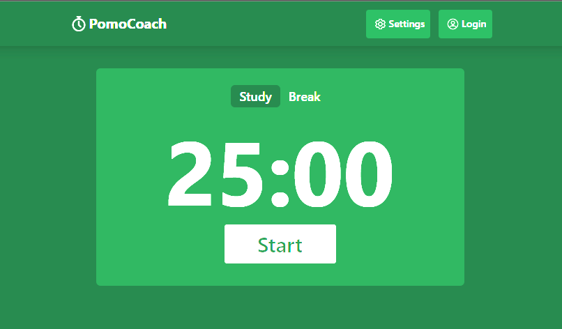
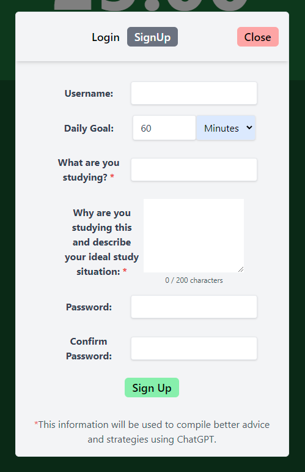
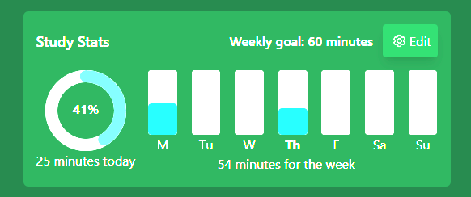
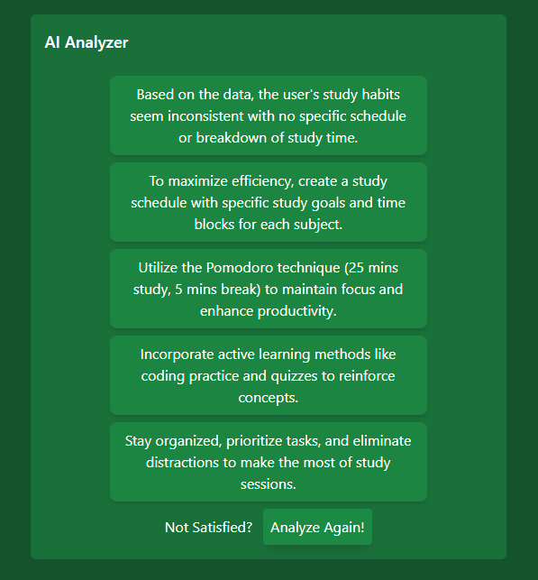

# PomoCoach: Optimizing Study Routines



Study habits can be challenging to establish and maintain. **PomoCoach** is not just a timer; it's a powerful accountability tool designed to help you implement a routine rooted in the proven Pomodoro Technique. This app aims to provide users with a structured study and decompression routine, optimizing their learning results.

## Overview
PomoCoach addresses the challenges of creating effective study habits by leveraging the Pomodoro Technique. Users can establish a study routine that balances focused work sessions with effective breaks, enhancing productivity and learning outcomes.

## Installation
To run this app you must have **Node.js** installed. You can check your version of Node.js with:
```bash
node -v
```
next, install dev dependencies:
```bash
npm install
```
and finally you can run the app in development by running:
```bash
npm run dev
```

## Core Features
This app allows anyone to swap beteen study and break sessions and utilize the time interval for both to build a smart and healthy routine.

## User Features




Users can now sign up for a profile and unlock the newest functionality that PomoCoach has to offer. The App allows user to offer additional information abut their study motivation and habits to offer more personalized results generated by OpenAi.

### Stat Tracking




Now you can effortlessly monitor your weekly habits with precision. Experience the convenience of a donut graph, showcasing your daily progress, alongside a comprehensive weekly bar graph to encapsulate your overall weekly achievements.

### AI Analyzer




Harnessing the powerful capabilities of OpenAI's GPT 4 model, PomoCoach introduces an enhanced feature set. Users can now delve into insightful analyses of their weekly study habits and receive tailored advice aimed at optimizing efficiency and enhancing productivity.


**Upgrade your productivity tracking with PomoCoach's new visualization tools today.**

## Implementation
PomoCoach was built using **Next.js** for the frontend and **Tailwind CSS** for a responsive sleek design. The AI analyzer feature utilizes OpenAI Technology for powerful insights.